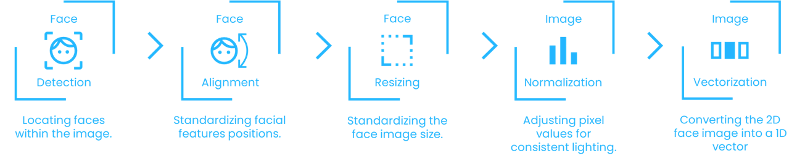
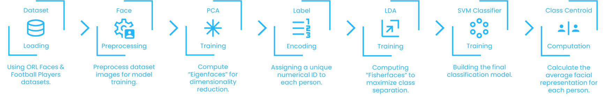
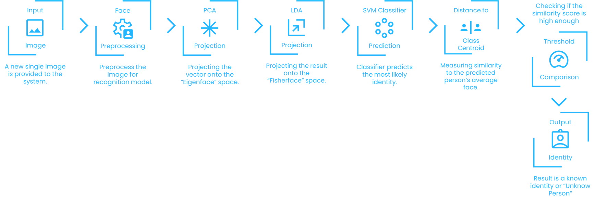
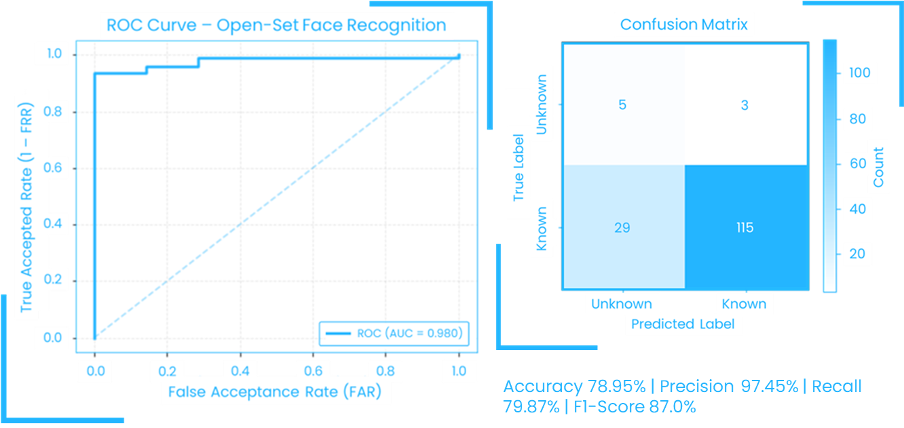

# Face Recognition Model with PCA

This repository implements a **classical face recognition system** using **Principal Component Analysis (PCA)**, **Linear Discriminant Analysis (LDA)**, and **Support Vector Machines (SVM)**. The system follows a traditional computer vision pipeline and includes a distance-based mechanism to identify **unknown faces**.

> **Academic Context**  
> This project was developed as the **[final project for a university-level Computer Vision course](https://github.com/Mahmoud46/Computer-Vision-Final-Project)**, focusing on classical face recognition techniques rather than deep learning–based approaches.

---

## Dataset

The dataset is a combination of:

- **The ORL (AT&T) Database of Faces**  
  https://www.kaggle.com/datasets/kasikrit/att-database-of-faces

- **Custom Football Players Dataset**, including:
  - Cristiano Ronaldo
  - Lionel Messi
  - Mohamed Salah
  - Achraf Hakimi
  - Kylian Mbappé
  - Toni Kroos

### Dataset Organization

The data is split into two main folders:

```bash
data/
├── train/
└── test/
```

### Training Set

- **ORL Dataset**:
  - 7 images per subject

- **Football Players**:
  - Cristiano Ronaldo: 12 images
  - Kylian Mbappé: 12 images
  - Lionel Messi: 11 images
  - Mohamed Salah: 12 images
  - Achraf Hakimi: 12 images
  - Toni Kroos: 11 images

### Test Set

- **ORL Dataset**:
  - 3 images per subject

- **Football Players**:
  - 4 images per player

- **Unknown Faces**:
  - 8 images not belonging to any known identity

---

## Face Preporcessing Pipeline



## Model Training Pipeline

The training process follows the pipeline below:



## Recognition Pipeline



## Model Evaluation

- **Accuracy:** (TP + TN) / (TP + TN + FP + FN) ≈ 78.95%
- **Precision:** TP / (TP + FP) = 115 / (115 + 3) ≈ 97.45%
- **Recall (Sensitivity):** TP / (TP + FN) = 115 / (115 + 29) ≈ 79.87%
- **F1-Score:** 2 _ (Precision _ Recall) / (Precision + Recall) ≈ 87.0%

## 

## Key Characteristics

- Classical face recognition pipeline (PCA + LDA)
- Robust preprocessing with face alignment and CLAHE
- Multi-class classification using SVM
- Unknown face detection via centroid distance thresholding
- Suitable for academic and educational evaluation

---

## Educational Purpose

This project is intended strictly for **educational use** and demonstrates core concepts in:

- Face detection and alignment
- Feature extraction and dimensionality reduction
- Classical machine learning–based face recognition
- Verification and unknown identity rejection

---

© 2023 Pixel Computer Vision Final Project Team | May 2023 | All rights reserved
